  

 

### 👨‍💻 About Me

I am a **Computer Engineering student** at Óbuda University, specialized in **Artificial Intelligence**. I am passionate about software development, ranging from high-level AI models to full-stack web solutions and system-level programming.

- 🔭 I’m currently working on: **Deep Learning & Big Data Projects**
- 🌱 I’m currently learning: **Modern C++, Computer Architecture, and Advanced AI**
- 💻 Tech Interests: **Software Engineering, AI Systems, Full Stack Development**

 

### 🛠️ Tech Stack & Academic Focus
  

  **🧠 AI & Data Science** 
  
  
  
  

   

  **💻 Software Engineering** 
  
  
  
  

   

  **🌠Web Development** 
  
  

 

```mermaid 
timeline
    title Academic & Career Path
    2023
        : Started BSc @ Obuda University
        : Computer Engineering Fundamentals
    2024 - 2025
        : 🧠 AI Specialization
        : Deep Learning & Full Stack Projects
        : Professional Experience @ Stratumax & Logiscool
    2026
        : Core Engineering focus
        : C++ & Computer Architecture
        : BSc Thesis Preparation
    2027
        : 🎓 BSc Graduation
        : 🇩🇪 Moving to Germany for MSc
    Future
        : Software Engineer @ DACH Region
        : Building Innovative Tech Solutions 🚀
```

Activity Map
<picture>
<source media="(prefers-color-scheme: dark)" srcset="https://raw.githubusercontent.com/MarkBenWagner/MarkBenWagner/output/github-contribution-grid-snake-dark.svg">
<source media="(prefers-color-scheme: light)" srcset="https://raw.githubusercontent.com/MarkBenWagner/MarkBenWagner/output/github-contribution-grid-snake.svg">

</picture>
