<div align="center">
  
</div>

<div align="center">
  <a href="https://github.com/MarkBenWagner">
    
  </a>
  <a href="https://linkedin.com/in/mark-b-wagner-50568b245/">
    
  </a>
</div>

<br/>

### 🚀 About Me

I am a passionate developer focusing on **Artificial Intelligence** and **Innovation**. I am currently on a journey to master Python for AI/ML and preparing for my Master's studies in Germany. 🇩🇪

- 🔭 I’m currently working on: **Daily Python AI Projects & Automation**
- 🌱 I’m currently learning: **Deep Learning, NLP, German, English**
- 📰 Reading about: **LLMs, Computer Vision, AI Ethics, Tech, Business**
- ⚡ Fun fact: I commit code every day to build a habit!
- 🌶️ Superpower: Turns caffeine into code ☕

```yaml
user_profile:
  name: "Mark Ben Wagner"
  role: "Computer Engineering Student"
  location: "Budapest, Hungary"
  current_focus: "Mastering AI & Deep Learning"
```

## 🛠️ Tech Stack & Tools
  <div align="left">

  **🧠 AI & Data Science**<br/>
  
  
  
  
  
  
  

  <br/>

  **💻 Programming Languages**<br/>
  
  
  

  <br/>

  **🎨 Web & Design**<br/>
  
  
  
  
  

  <br/>

  **⚙️ Tools & DevOps**<br/>
  
  
  
  
  

</div>





```mermaid 
timeline
    title My Journey to AI Innovation
    2022
        : High School Diploma
        : Codecool Frontend Course
    2023
        : Started BSc @ Obuda Uni
        : Computer Engineering (AI Focus)
    2024 - 2025
        : 💼 Co-Founder @ Stratumax (🏆 Won 2 Startup Competitions)
        : 👨‍🏫 Logiscool Teacher (Python, AI, Block-based)
        : Web development - 15 websites
    2026
        : Advanced Deep Learning Studies
        : Preparing BSc Thesis
    2027
        : 🎓 BSc Graduation (Jan)
        : 🇩🇪 Move to Germany (MSc Start Oct)
    2028 - 2029
        : AI Research Intern (Big Tech)
        : MSc Graduation
    Future
        : Lead AI Researcher
        : Launching Own AI Unicorn 🚀
```

📈 GitHub Stats
<div align="center">  </div>


### Contribution History

<picture>
  <source media="(prefers-color-scheme: dark)" srcset="https://raw.githubusercontent.com/MarkBenWagner/MarkBenWagner/output/github-contribution-grid-snake-dark.svg">
  <source media="(prefers-color-scheme: light)" srcset="https://raw.githubusercontent.com/MarkBenWagner/MarkBenWagner/output/github-contribution-grid-snake.svg">
  
</picture>


